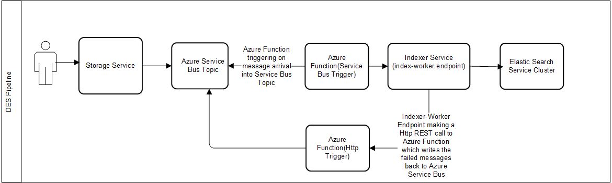

# Introduction 
This repository contains implementation code for what is formerly called as Indexer queue services which provides a set of APIs that help in forwarding the messages to and from storage service to indexer service.

## Azure Documentation

Instructions for running `os-indexer-queue-azure` can be found [here](./indexer-queue-azure-enqueue)

##Pre-requisites

1. JDK 8
2. Java Developer Kit (JDK), version 8
3. Apache Maven, version 3.0 or higher
4. IntelliJ IDEA, Community or Ultimate versions with Maven
5. Azure CLI
6. Azure Functions Core Tools, version 2.


You will also require Git to work on the project.


## Running the Indexer Queue service locally
Navigate to indexer queue service's root folder and run:
```sh
Run mvn clean package 
```
### Running the Indexer Queue service in GCP
Navigate to indexer-queue-boot-gcp folder and run:
```sh
TODO

````
### Running the Indexer Queue service in Azure
The indexer-queue-azure module is a set of two Azure functions that are created to perform the role of EnqueueApi and TaskApi that exist in the current GCP implementation. 
1. The indexer-queue-azure-enqueue Azure function gets triggered when a message arrives on an Azure ServiceBus Topic/Subscription from Storage service.  The function will take the message
and posts the message to indexer-worker Api endpoint in the Indexer service
2. The indexer-queue-azure-requeue Azure function is called by the indexer-worker-api when it fails to process all or subset of mesages that it received from Storage service (see #1 above) 
and posts those back to ServiceBus.  This will again kick-off the workflow described in #1 above.


 
#### Running the Enqueue Service
```sh
1.Make sure the POM file inside the indexer-queue-auzre-enqueue folder has the 'properties' section properly modified to 
refelct the correct Azure functionApp name, region, and ResourceGroup Name.  Example Shown below
<properties>
        <project.build.sourceEncoding>UTF-8</project.build.sourceEncoding>
        <maven.compiler.source>1.8</maven.compiler.source>
        <maven.compiler.target>1.8</maven.compiler.target>
        <azure.functions.maven.plugin.version>1.3.3</azure.functions.maven.plugin.version>
        <azure.functions.java.library.version>1.3.0</azure.functions.java.library.version>
        <functionAppName>EnqueueFunction</functionAppName>
        <functionAppRegion>westus</functionAppRegion>
        <stagingDirectory>${project.build.directory}/azure-functions/${functionAppName}</stagingDirectory>
        <functionResourceGroup>SLBIndexQueueServicesRG</functionResourceGroup>
</properties>
```
Navigate to indexer-queue-azure-enqueue folder
##### Running locally
```sh
Run mvn azure-functions:run
````

##### Running in Azure 
```sh
1. Run mvn azure-functions:deploy
````
If you want to learn more about creating good readme files then refer the following [guidelines](https://docs.microsoft.com/en-us/azure/devops/repos/git/create-a-readme?view=azure-devops). You can also seek inspiration from the below readme files:
- [ASP.NET Core](https://github.com/aspnet/Home)
- [Visual Studio Code](https://github.com/Microsoft/vscode)
- [Chakra Core](https://github.com/Microsoft/ChakraCore)

## GCP

Instructions for running the Google Cloud Platform implementation locally can be found [here](./indexer-queue-gcp/README.md).

###
Sample Request for various projects:
1. indexer-queue-boot-gcp project:

    curl -X POST \
      https://os-indexer-queue-dot-opendes.appspot.com/_dps/task-handlers/enqueue \
      -H 'Accept: */*' \
      -H 'Authorization: Bearer <auth-token>
      -H 'Content-Type: application/json' \
      -H 'Host: os-indexer-queue-dot-opendes.appspot.com' \
      -H 'account-id: common' \
      -d '{
        "message": "{\"data\":[{\"id\":\"common:welldb:dummy\",\"kind\":\"common:welldb:wellbore:1.0.0\",\"op\":\"create\"}],\"account-id\":\"common\",\"data-partition-id\":\"common\",\"correlation-id\":\"ee85038e-4510-49d9-b2ec-3651315a4d00\"}",
        "url": "/api/indexer/v2/_dps/task-handlers/index-worker"
    }'

    curl -X POST \
      https://os-indexer-queue-dot-opendes.appspot.com/_ah/push-handlers/enqueue \
      -H 'Content-Type: application/json' \
      -H 'Host: os-indexer-queue-dot-opendes.appspot.com' \
      -H 'account-id: common' \
      -d '{
        "message": {
            "data": "W3tcImlkXCI6XCJ0ZW5hbnQxOndlbGxkYjp3ZWxsYm9yZS1kOTAzM2FlMS1mYjE1LTQ5NmMtOWJhMC04ODBmZDFkMmIyY2ZcIixcImtpbmRcIjpcInRlbmFudDE6d2VsbGRiOndlbGxib3JlOjEuMC4wXCIsXCJvcFwiOlwiY3JlYXRlXCJ9XQ==",
            "attributes": {
                "account-id": "common",
                "slb-correlation-id": "b5a281bd-f59d-4db2-9939-b2d85036fc7e"
            },
            "messageId": "75328163778221",
            "publishTime": "2018-05-08T21:48:56.131Z"
        }
    }'
    
2. Re-enqueue Function:

curl -X POST \
  http://localhost:9000/api/re-enqueue \
  -H 'Content-Type: application/json' \
  -d '{
    "message": "{\"data\":[{\"id\":\"common:welldb:asd21\",\"kind\":\"common:welldb:wellbore:1.0.0\",\"op\":\"create\"}],\"account-id\":\"common\",\"data-partition-id\":\"common\",\"correlation-id\":\"ee85038e-4510-49d9-b2ec-3651315a4d00\"}",
    "url": "foo"
}'


