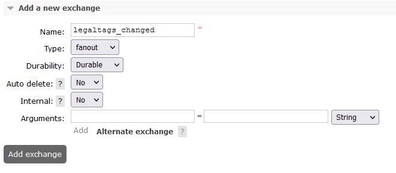
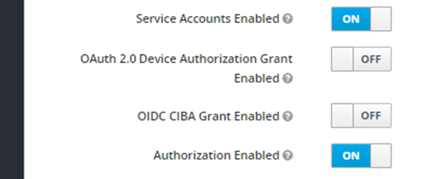

# Service Configuration for Anthos

## Table of Contents <a name="TOC"></a>
* [Environment variables](#Environment-variables)
    * [Common properties for all environments](#Common-properties-for-all-environments)
    * [For Mappers to activate drivers](#For-Mappers-to-activate-drivers)
* [Requirements for requests](#Requirements-for-requests)
* [Configuring mappers Datasources](#Configuring-mappers-Datasources)
    * [For OSM Postgres](#For-OSM-Postgres)
        * [Postgres schema configuration](#Postgres-schema-configuration)
    * [For OBM MinIO](#For-OBM-MinIO)
        * [Bucket configuration](#Bucket-configuration)
    * [For OQM RabbitMQ](#For-OQM-RabbitMQ)
        * [Exchanges and queues configuration](#Exchanges-and-queues-configuration)
* [Interaction with message brokers](#Interaction-with-message-brokers)
* [Keycloak configuration](#Keycloak-configuration)

## Environment variables

### Must have

| name | value | description | sensitive? | source |
| ---  | ---   | ---         | ---        | ---    |
| `SPRING_PROFILES_ACTIVE` | ex `anthos` | Spring profile that activate default configuration for Anthos environment | false | - |
| `<AMQP_PASSWORD_ENV_VARIABLE_NAME>` | ex `AMQP_PASS_OSDU` | Amqp password env name, name of that variable not defined at the service level, the name will be received through partition service. Each tenant can have it's own ENV name value, and it must be present in ENV of Wks service | yes | - |
| `<AMQP_ADMIN_PASSWORD_ENV_VARIABLE_NAME>` | ex `AMQP_ADMIN_PASS_OSDU` | Amqp admin password env name, name of that variable not defined at the service level, the name will be received through partition service. Each tenant can have it's own ENV name value, and it must be present in ENV of Wks service | yes | - |

### Defined in default application property file but possible to override

| name | value | description | sensitive? | source |
| ---  | ---   | ---         | ---        | ---    |
| `OSDU_ENTITLEMENTS_URL` | ex `https://entitlements.com/entitlements/v1` | Entitlements API endpoint | no | output of infrastructure deployment |
| `PARTITION_API` | ex `http://localhost:8081/api/partition/v1` | Partition service endpoint | no | - |
| `INDEXER_HOST` | ex `http://indexer` | Should be provided when `INDEX_TASK_TYPE == rest` only. Indexer Service host, base url to send REST request to Indexer, combined with relative indexer worker url | no | output of infrastructure deployment |
| `RECORDS_CHANGE_TOPIC_NAME` | ex `records-changed` | Name of queue for receiving messages from Storage service about records changes | no | - |
| `DEFAULT_QUEUE_NAME` | ex `records` | Name of queue for sending messages with records info  to Indexer service | no | - |
| `OQMDRIVER` | `pubsub` OR `rabbitmq` | Oqm driver mode that defines which queue will be used | no | - |
| `INDEX_TASK_TYPE` | `cloud-task` OR `queue` OR `rest` | The property enables the support of Google Cloud Tasks / REST requests / Queue messaging. | no | - |

### Properties set in Partition service:

Note that properties can be set in Partition as `sensitive` in that case in property `value` should be present not value itself, but ENV variable name.
This variable should be present in environment of service that need that variable.

Example:
```
    "elasticsearch.port": {
      "sensitive": false, <- value not sensitive 
      "value": "9243"  <- will be used as is.
    },
      "elasticsearch.password": {
      "sensitive": true, <- value is sensitive 
      "value": "ELASTIC_SEARCH_PASSWORD_OSDU" <- service consumer should have env variable ELASTIC_SEARCH_PASSWORD_OSDU with elastic search password
    }
```

### For OQM RabbitMQ

**prefix:** `oqm.rabbitmq`
It can be overridden by:

- through the Spring Boot property `oqm.rabbitmq.partition-properties-prefix`
- environment variable `OQM_RABBITMQ_PARTITION_PROPERTIES_PREFIX``

**Propertyset** (for two types of connection: messaging and admin operations):

| Property | Description |
| --- | --- |
| oqm.rabbitmq.amqp.host | messaging hostnameorIP |
| oqm.rabbitmq.amqp.port | - port |
| oqm.rabbitmq.amqp.path | - path |
| oqm.rabbitmq.amqp.username | - username |
| oqm.rabbitmq.amqp.password | - password |
| oqm.rabbitmq.admin.schema | admin host schema |
| oqm.rabbitmq.admin.host | - host name |
| oqm.rabbitmq.admin.port | - port |
| oqm.rabbitmq.admin.path | - path |
| oqm.rabbitmq.admin.username | - username |
| oqm.rabbitmq.admin.password | - password |

<details><summary>Example of a single tenant definition</summary>

```

curl -L -X PATCH 'https://dev.osdu.club/api/partition/v1/partitions/opendes' -H 'data-partition-id: opendes' -H 'Authorization: Bearer ...' -H 'Content-Type: application/json' --data-raw '{
  "properties": {
    "oqm.rabbitmq.amqp.host": {
      "sensitive": false,
      "value": "localhost"
    },
    "oqm.rabbitmq.amqp.port": {
      "sensitive": false,
      "value": "5672"
    },
    "oqm.rabbitmq.amqp.path": {
      "sensitive": false,
      "value": ""
    },
    "oqm.rabbitmq.amqp.username": {
      "sensitive": false,
      "value": "guest"
    },
    "oqm.rabbitmq.amqp.password": {
      "sensitive": true,
      "value": "<AMQP_PASSWORD_ENV_VARIABLE_NAME>" <- (Not actual value, just name of env variable)
     },
     "oqm.rabbitmq.admin.schema": {
      "sensitive": false,
      "value": "http"
    },
     "oqm.rabbitmq.admin.host": {
      "sensitive": false,
      "value": "localhost"
    },
    "oqm.rabbitmq.admin.port": {
      "sensitive": false,
      "value": "9002"
    },
    "oqm.rabbitmq.admin.path": {
      "sensitive": false,
      "value": "/api"
    },
    "oqm.rabbitmq.admin.username": {
      "sensitive": false,
      "value": "guest"
    },
    "oqm.rabbitmq.admin.password": {
      "sensitive": true,
      "value": "<AMQP_ADMIN_PASSWORD_ENV_VARIABLE_NAME>" <- (Not actual value, just name of env variable)
    }
  }
}'

```

</details>

#### Exchanges and queues configuration

At RabbitMq should be created exchanges with name:

1. **name:** `records_changed`

It can be overridden by:

- through the Spring Boot property `records_changed_topic_name`
- environment variable `RECORDS_CHANGED_TOPIC_NAME`

2.  **name:** `records`

It can be overridden by:

- through the Spring Boot property `records_topic_name`
- environment variable `RECORDS_TOPIC_NAME`



## Interaction with message brokers

### Specifics of work through PULL subscription

To receive messages from brokers, this solution uses the PULL-subscriber mechanism to get 'record_changed' messages.
This is its cardinal difference from other implementations that use PUSH-subscribers (webhooks). This opens a wide
choice when choosing brokers.

When using PULL-subscribers, there is a need to restore Storage service subscribers at the start of Storage service.
This magic happens in the `OqmSubscriberManager.java` class from `core-lib-gcp` in the @PostConstruct method.

## Keycloak configuration

[Keycloak service accounts setup](https://www.keycloak.org/docs/latest/server_admin/#_service_accounts)

Configure Clients. One Client per OSDU service. Set them “confidential”.


Each Client has embedded Service Account (SA) option. Enable SAs for Clients, make “Authorization enabled”:



Add `partition-and-entitlements` scope to `Default Client Scopes` and generate Keys.

Give `client-id` and `client-secret` to services, which should be authorized within the platform.